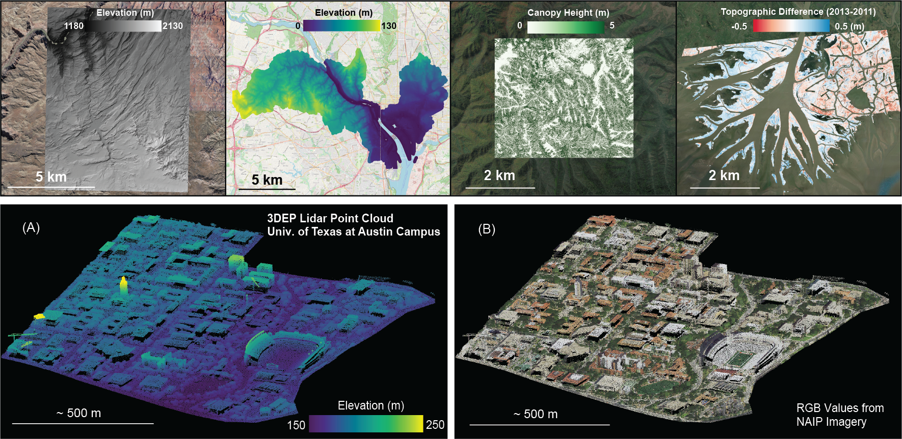

[](https://nsf.gov/awardsearch/showAward?AWD_ID=1948997) 
[](https://nsf.gov/awardsearch/showAward?AWD_ID=1948994)
[](https://nsf.gov/awardsearch/showAward?AWD_ID=1948857)

# Reproducible scientific workflows for accessing, processing, and visualizing USGS 3DEP lidar data
The U.S. Geological Survey 3D Elevation Program (3DEP) is acquiring high-quality light detecting and ranging (lidar) data over the conterminous United States, Hawaii, and US Territories to meet the growing need for high-resolution 3-D representations of Earth's surface, vegetation, and other constructed features.

This repository contains a suite of customizable and reproducible workflows implemented as Jupyter Notebooks for programmatically accessing, processing, and visualizing USGS 3DEP lidar point cloud data and creating a range of derivative products (DEMs, topographic difference maps, canopy height models, and colorized point clouds). Each notebook is designed to address a specific use case/geospatial application and leverages open source geospatial software (e.g. PDAL,GDAL) along with detailed documentation that lower the barrier of entry for users with minimal programming experience. 



## Installation
The Jupyter Notebooks can be run locally or on the <a href="https://colab.research.google.com/">Google Colaboratory</a> cloud platform (Requires Google account with Google Drive access).

**Dependencies**
* gdal
* geopandas
* ipyleaflet
* matplotlib
* pdal
* pyproj
* requests
* rioxarray

**Option 1 (Recommended): Google Colaboratory Installation**

For quickly getting started and ease-of-use, it is recommended to launch and execute these notebooks on the Google Colaboratory ("Colab") cloud platform. Dependencies will be installed on a virtual environment on Google's cloud servers and the code will be executed in the browser. A major benefit is direct access to Google high-end CPU/GPUs and avoiding software dependency issues. All products will be saved to your personal Google Drive. Google Colab users are allocated 12GB of RAM (which can be upgraded to 25GB with Colab Pro). User's are advised that accessing and processing large point clouds (>100,000,000 points) may consume this RAM allocation and cause the runtime to fail. Those seeking to process large quantities of data may benefit from running the notebooks locally (Option 2). 

To experiment and run one of the below Jupyter Notebooks on Google Colab click the  badge beneath the corresponding Jupyter Notebook in the **USGS 3DEP Jupyter Notebooks** section, below.

**Option 2: Local Installation**

In order to run the Jupyter Notebook on your local machine, follow these steps:

Make a new directory on your local file system where the 3DEP Jupyter Notebooks (and all 3DEP data, if desired) will be saved. In this case, the directory will be called `3DEP`. Change into the new directory and git clone the Github repository containing the Jupyter Notebooks and other relevant files to your local file system.

```bash
mkdir 3DEP
cd 3DEP
git clone https://github.com/OpenTopography/OT_3DEP_Workflows
```

Anaconda is recommended for Python package installation and management. Package versions in Anaconda are managed by the package management system *conda*. Anaconda installers for MacOS/Linux/Windows can be downloaded from https://docs.anaconda.com/anaconda/install/. Follow the instructions to install the appropriate version of Anaconda for your operating system.

After installing Anaconda, create a conda virtual environment with the required dependencies (contained in `environment.yml`). Note: Exectuting the following command will automatically create the conda environment with name `3dep` and all of the required dependencies installed. If you would prefer a different name, replace `3dep` with another name in the following command:

```bash
cd OT_3DEP_Workflows
conda env create -n 3dep --file environment.yml
```

Activate the conda environment with all of the necessary dependencies installed. (If different, substitute '3dep' for the name of your new conda environment.)

```bash
conda activate 3dep
```

Now, launch the chosen Jupyter Notebook. If unsure how to launch a Notebook, refer to this guide (https://jupyter-notebook-beginner-guide.readthedocs.io/en/latest/execute.html). 

## USGS 3DEP Jupyter Notebooks

1. [Generate and visualize DEMs (DTM and DSM) from USGS 3D Elevation Program (3DEP) lidar data for user-defined area of interest](https://github.com/OpenTopography/OT_3DEP_Workflows/blob/main/notebooks/01_3DEP_Generate_DEM_User_AOI.ipynb)[](https://colab.research.google.com/github/OpenTopography/OT_3DEP_Workflows/blob/main/notebooks/01_3DEP_Generate_DEM_User_AOI.ipynb) <br>

2. [Generate and visualize DEMs (DTM and DSM) from USGS 3D Elevation Program (3DEP) lidar data for USGS 7.5’ Quadrangles](https://github.com/OpenTopography/OT_3DEP_Workflows/blob/main/notebooks/02_3DEP_Generate_DEM_USGS_7.5_Quadrangles.ipynb)[](https://colab.research.google.com/github/OpenTopography/OT_3DEP_Workflows/blob/main/notebooks/02_3DEP_Generate_DEM_USGS_7.5_Quadrangles.ipynb) <br>

3. [Generate and visualize DEMs (DTM and DSM) from USGS 3D Elevation Program (3DEP) lidar data for USGS Hydrologic Units](https://github.com/OpenTopography/OT_3DEP_Workflows/blob/main/notebooks/03_3DEP_Generate_DEM_USGS_HUCs.ipynb)[](https://colab.research.google.com/github/OpenTopography/OT_3DEP_Workflows/blob/main/notebooks/03_3DEP_Generate_DEM_USGS_HUCs.ipynb) <br>

4. [Generate and visualize DEMs (DTM and DSM) from USGS 3D Elevation Program (3DEP) lidar data for user-defined corridors](https://github.com/OpenTopography/OT_3DEP_Workflows/blob/main/notebooks/04_3DEP_Generate_DEM_Corridors.ipynb)[](https://colab.research.google.com/github/OpenTopography/OT_3DEP_Workflows/blob/main/notebooks/04_3DEP_Generate_DEM_Corridors.ipynb) <br>

5. [Generate Canopy Height Model (CHM) using USGS 3D Elevation Program (3DEP) lidar data for user-defined area of interest](https://github.com/OpenTopography/OT_3DEP_Workflows/blob/main/notebooks/05_3DEP_Generate_Canopy_Height_Models_User_AOI.ipynb)[](https://colab.research.google.com/github/OpenTopography/OT_3DEP_Workflows/blob/main/notebooks/05_3DEP_Generate_Canopy_Height_Models_User_AOI.ipynb) <br>

6. [Topographic Differencing using USGS 3D Elevation Program (3DEP) lidar data for user-defined area of interest](https://github.com/OpenTopography/OT_3DEP_Workflows/blob/main/notebooks/06_3DEP_Topographic_Differencing.ipynb)[](https://colab.research.google.com/github/OpenTopography/OT_3DEP_Workflows/blob/main/notebooks/06_3DEP_Topographic_Differencing.ipynb) <br>

7. [Generate colorized (RGB) point clouds using USGS 3D Elevation Program (3DEP) lidar data and National Agriculture Imagery Program (NAIP) Imagery](https://github.com/OpenTopography/OT_3DEP_Workflows/blob/main/notebooks/07_3DEP_Generate_Colorized_PointClouds.ipynb)[](https://colab.research.google.com/github/OpenTopography/OT_3DEP_Workflows/blob/main/notebooks/07_3DEP_Generate_Colorized_PointClouds.ipynb)

## Issues and Feature Improvements

Reporting issues and/or providing suggestions for improving these workflows or developing new ones is highly encouranged. Issues or suggested feature improvements may be submitted as an <a href="https://github.com/OpenTopography/OT_3DEP_Workflows/issues">issue</a> or by email to <a href="https://opentopography.org/contact">OpenTopography Support</a>.   

## Funding 

Funding for the creation and distribution of these Jupyter Notebook-based workflows was provided as by the <a href="https://www.usgs.gov/centers/community-for-data-integration-cdi">USGS Community for Data Integration (CDI)</a> through the funded grant <a href="https://www.usgs.gov/centers/community-for-data-integration-cdi/science/enhancing-usability-3dep-data-and-web-services"> *Enhancing usability of 3DEP data and web services with Jupyter Notebooks*</a>. 

OpenTopography is supported by the National Science Foundation (NSF) under Award Numbers <a href="https://nsf.gov/awardsearch/showAward?AWD_ID=1948997">1948997</a>, <a href="https://nsf.gov/awardsearch/showAward?AWD_ID=1948994">1948994</a> & <a href ="https://nsf.gov/awardsearch/showAward?AWD_ID=1948857">1948857</a>.

## Additional Resources

- The USGS 3DEP lidar point ploud pata are accessible in Entwine Point Tile (EPT) format from this <a href="https://registry.opendata.aws/usgs-lidar/">Amazon Web Services S3 Bucket</a>.

- The USGS hydrologic unit boundaries are accessed via the <a href="https://hydro.nationalmap.gov/arcgis/rest/services/wbd/MapServer">USGS Watershed Dataset Map Service</a>.

- The USGS 7.5' quadrangle boundaries are accessed via the <a href="https://carto.nationalmap.gov/arcgis/rest/services/map_indices/MapServer"> USGS Map Indicies Service</a>.

- Documentation for open-source Python libararies used by these workflows include <a href="https://pdal.dev/en/latest/">PDAL</a> and <a href="https://gdal.org/">GDAL</a>.

- The <a href="https://www.unavco.org/">UNAVCO</a> Student Internship Program (<a href="https://www.unavco.org/education/student-internships/unavco-student-internship-program/">USIP</a>).

- Access USGS 3DEP via the <a href="https://portal.opentopography.org/datasets">OpenTopography</a> portal.
